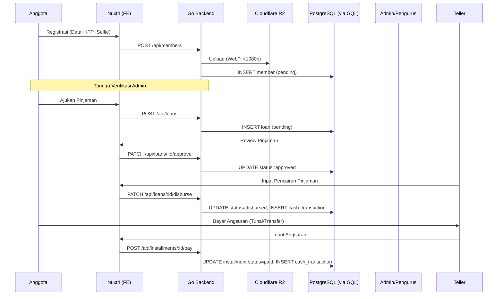

# PRD - Koperasi Simpan Pinjam

## 1. Overview

Aplikasi web untuk mengelola operasional koperasi simpan pinjam, mencakup manajemen anggota, simpanan, pinjaman, angsuran, dan pelaporan keuangan.

## 2. Tech Stack

| Layer | Teknologi |
|-------|-----------|
| Frontend | Nuxt 4 |
| Auth | Better Auth (di Nuxt layer) |
| Backend | Go (Layered Architecture) |
| Data Service | Drizzle ORM + GraphQL (Node.js) |
| Database | PostgreSQL |
| Styling & Tools | Vinicunca (UnoCSS, ESLint, Perkakas, UnoCSSVariants) |

## 3. Arsitektur

### 3.1 Diagram

```
┌─────────────┐        ┌──────────────────┐        ┌──────────────────┐
│   Nuxt 4    │──REST─▶│  Go Backend      │──GQL──▶│  Drizzle + GQL   │
│  + Auth     │        │  (Business Logic)│        │  (Data Service)  │
└─────────────┘        └──────────────────┘        └──────────────────┘
                                                          │
                                                          ▼
                                                     PostgreSQL
```

- **Nuxt 4**: UI, routing, SSR, autentikasi (Better Auth)
- **Go Backend**: business logic, validasi, kalkulasi bunga, REST API
- **Drizzle + GraphQL**: dumb data access layer (CRUD murni, no business logic)

### 3.2 Folder Structure (Monorepo Flat Root)

```
sp/
├── data-service/                         # Node.js — Drizzle ORM + GraphQL
│   ├── src/
│   │   ├── db/
│   │   │   ├── schema/
│   │   │   │   ├── members.ts
│   │   │   │   ├── savings.ts
│   │   │   │   ├── loans.ts
│   │   │   │   ├── installments.ts
│   │   │   │   ├── cash.ts
│   │   │   │   ├── shu.ts
│   │   │   │   ├── settings.ts
│   │   │   │   ├── users.ts
│   │   │   │   └── index.ts
│   │   │   ├── migrations/
│   │   │   └── index.ts
│   │   ├── graphql/
│   │   │   ├── typeDefs/
│   │   │   │   ├── members.ts
│   │   │   │   ├── savings.ts
│   │   │   │   ├── loans.ts
│   │   │   │   ├── installments.ts
│   │   │   │   ├── cash.ts
│   │   │   │   ├── shu.ts
│   │   │   │   ├── settings.ts
│   │   │   │   ├── users.ts
│   │   │   │   └── index.ts
│   │   │   ├── resolvers/
│   │   │   │   ├── members.ts
│   │   │   │   ├── savings.ts
│   │   │   │   ├── loans.ts
│   │   │   │   ├── installments.ts
│   │   │   │   ├── cash.ts
│   │   │   │   ├── shu.ts
│   │   │   │   ├── settings.ts
│   │   │   │   ├── users.ts
│   │   │   │   └── index.ts
│   │   │   └── index.ts
│   │   └── index.ts
│   ├── drizzle.config.ts
│   ├── package.json
│   └── tsconfig.json
│
├── backend/                              # Go — Layered Architecture
│   ├── cmd/
│   │   └── api/
│   │       └── main.go
│   ├── internal/
│   │   ├── config/
│   │   ├── domain/
│   │   │   ├── member.go
│   │   │   ├── savings.go
│   │   │   ├── loan.go
│   │   │   ├── installment.go
│   │   │   ├── cash.go
│   │   │   ├── shu.go
│   │   │   └── report.go
│   │   ├── handler/
│   │   │   ├── member_handler.go
│   │   │   ├── savings_handler.go
│   │   │   ├── loan_handler.go
│   │   │   ├── installment_handler.go
│   │   │   └── cash_handler.go
│   │   ├── service/
│   │   │   ├── member_service.go
│   │   │   ├── savings_service.go
│   │   │   ├── loan_service.go
│   │   │   ├── installment_service.go
│   │   │   └── shu_service.go
│   │   ├── repository/
│   │   │   ├── graphql_client.go
│   │   │   ├── member_repository.go
│   │   │   ├── savings_repository.go
│   │   │   ├── loan_repository.go
│   │   │   └── cash_repository.go
│   │   ├── storage/
│   │   │   └── r2.go
│   │   └── middleware/
│   │       └── auth.go
│   ├── go.mod
│   └── go.sum
│
├── web/                                  # Nuxt 4 — Frontend + BFF
│   ├── app/
│   │   ├── assets/
│   │   ├── components/
│   │   ├── composables/
│   │   ├── layouts/
│   │   ├── middleware/
│   │   ├── pages/
│   │   └── utils/
│   ├── server/
│   │   └── api/
│   │       ├── auth/                     # Better Auth endpoints
│   │       ├── superadmin/               # Settings, user management
│   │       │   ├── settings/
│   │       │   └── users/
│   │       ├── admin/                    # Verifikasi, approval, laporan, SHU
│   │       │   ├── members/
│   │       │   ├── loans/
│   │       │   ├── reports/
│   │       │   └── shu/
│   │       ├── teller/                   # Transaksi harian
│   │       │   ├── savings/
│   │       │   ├── installments/
│   │       │   └── loans/
│   │       └── anggota/                  # Self-service portal
│   │           ├── profile/
│   │           ├── savings/
│   │           ├── loans/
│   │           └── installments/
│   ├── uno.config.ts
│   ├── nuxt.config.ts
│   └── package.json
│
└── PRD.md

## 4. User Roles & Access Control

| Role | Deskripsi |
|------|-----------|
| Super Admin | Full access, kelola semua data & konfigurasi sistem |
| Admin / Pengurus | Kelola anggota, approve pinjaman, input transaksi |
| Teller | Input simpanan, angsuran, penarikan |
| Anggota | Lihat saldo, histori transaksi, ajukan pinjaman |

### Matriks Hak Akses

| Fitur | Super Admin | Admin/Pengurus | Teller | Anggota |
|---|---|---|---|---|
| **Manajemen Anggota** | | | | |
| Registrasi anggota baru | ✅ | ✅ | ❌ | ❌ |
| Verifikasi KTP & foto | ✅ | ✅ | ❌ | ❌ |
| Edit data anggota | ✅ | ✅ | ❌ | ❌ |
| Nonaktifkan anggota | ✅ | ✅ | ❌ | ❌ |
| Lihat daftar anggota | ✅ | ✅ | ✅ | ❌ |
| Lihat profil sendiri | ✅ | ✅ | ✅ | ✅ |
| **Simpanan** | | | | |
| Setor simpanan | ✅ | ✅ | ✅ | ❌ |
| Tarik simpanan sukarela | ✅ | ✅ | ✅ | ❌ |
| Lihat histori simpanan (semua) | ✅ | ✅ | ✅ | ❌ |
| Lihat saldo & histori sendiri | ✅ | ✅ | ✅ | ✅ |
| **Pinjaman** | | | | |
| Ajukan pinjaman | ❌ | ❌ | ❌ | ✅ |
| Review & approve pinjaman | ✅ | ✅ | ❌ | ❌ |
| Tolak pinjaman | ✅ | ✅ | ❌ | ❌ |
| Cairkan pinjaman | ✅ | ✅ | ❌ | ❌ |
| Lihat semua pinjaman | ✅ | ✅ | ✅ | ❌ |
| Lihat pinjaman sendiri | ❌ | ❌ | ❌ | ✅ |
| Cetak surat perjanjian | ✅ | ✅ | ❌ | ❌ |
| **Angsuran** | | | | |
| Input pembayaran angsuran | ✅ | ✅ | ✅ | ❌ |
| Pelunasan dipercepat | ✅ | ✅ | ✅ | ❌ |
| Lihat jadwal angsuran (semua) | ✅ | ✅ | ✅ | ❌ |
| Lihat jadwal angsuran sendiri | ❌ | ❌ | ❌ | ✅ |
| **Kas & Keuangan** | | | | |
| Input kas masuk/keluar | ✅ | ✅ | ❌ | ❌ |
| Lihat jurnal kas | ✅ | ✅ | ❌ | ❌ |
| Lihat saldo kas | ✅ | ✅ | ❌ | ❌ |
| **SHU** | | | | |
| Hitung & distribusi SHU | ✅ | ✅ | ❌ | ❌ |
| Lihat laporan SHU | ✅ | ✅ | ❌ | ❌ |
| Lihat SHU sendiri | ❌ | ❌ | ❌ | ✅ |
| **Laporan** | | | | |
| Semua laporan | ✅ | ✅ | ❌ | ❌ |
| Export PDF/Excel | ✅ | ✅ | ❌ | ❌ |
| Laporan transaksi harian | ✅ | ✅ | ✅ | ❌ |
| **Dashboard** | | | | |
| Dashboard global | ✅ | ✅ | ❌ | ❌ |
| Dashboard teller (transaksi hari ini) | ❌ | ❌ | ✅ | ❌ |
| Dashboard anggota (saldo, status pinjaman) | ❌ | ❌ | ❌ | ✅ |
| **Pengaturan Sistem** | | | | |
| Konfigurasi bunga, plafon, denda | ✅ | ❌ | ❌ | ❌ |
| Manajemen user & role | ✅ | ❌ | ❌ | ❌ |
| Profil koperasi | ✅ | ❌ | ❌ | ❌ |

## 5. Modul & Fitur

### 5.1 Manajemen Anggota

- Registrasi anggota baru (data diri, KTP, alamat, pekerjaan)
- Upload foto KTP
- Upload foto selfie dengan KTP (verifikasi identitas)
- Verifikasi manual oleh Admin/Pengurus (approve/reject berdasarkan foto)
- Edit & nonaktifkan anggota
- Nomor anggota auto-generate
- Simpanan pokok otomatis saat registrasi
- Daftar anggota dengan search & filter
- Detail profil anggota (saldo, histori)
- Status verifikasi: Belum Diverifikasi → Terverifikasi / Ditolak

### 5.2 Simpanan

Jenis simpanan:

| Jenis | Deskripsi |
|-------|-----------|
| Simpanan Pokok | Dibayar sekali saat mendaftar |
| Simpanan Wajib | Dibayar rutin per bulan |
| Simpanan Sukarela | Setor/tarik kapan saja |

Mekanisme transaksi: **Manual (Opsi A)**
- Anggota setor tunai ke teller / transfer ke rekening koperasi
- Teller input transaksi di sistem
- Sistem update saldo otomatis
- Bukti transaksi dicetak / dikirim digital

Fitur:
- Setor simpanan (input oleh Teller/Admin)
- Tarik simpanan sukarela (input oleh Teller/Admin)
- Histori transaksi simpanan
- Saldo real-time per anggota
- Cetak bukti transaksi
- Laporan simpanan per periode

### 5.3 Pinjaman

- Pengajuan pinjaman oleh anggota (via aplikasi)
- Review & approval oleh Admin/Pengurus
- Konfigurasi:
  - Plafon pinjaman (berdasarkan kelipatan simpanan / setting manual)
  - Suku bunga (flat / anuitas)
  - Tenor (bulan)
  - Denda keterlambatan
- Status pinjaman: Diajukan → Disetujui → Dicairkan → Lunas / Ditolak
- Pencairan: Teller/Admin mencatat pencairan setelah dana diserahkan (tunai/transfer manual)
- Satu anggota bisa punya pinjaman aktif (configurable: boleh > 1 atau tidak)
- Cetak surat perjanjian pinjaman

### 5.4 Angsuran

Mekanisme pembayaran: **Manual**
- Anggota bayar tunai ke teller / transfer ke rekening koperasi
- Teller input pembayaran angsuran di sistem
- Sistem update status angsuran & sisa pokok otomatis

Fitur:
- Input pembayaran angsuran (oleh Teller/Admin)
- Jadwal angsuran otomatis (generate saat pinjaman dicairkan)
- Kalkulasi:
  - Pokok per bulan
  - Bunga per bulan
  - Sisa pokok
  - Denda (jika telat)
- Status per angsuran: Belum Bayar / Lunas / Telat
- Pelunasan dipercepat
- Cetak bukti pembayaran angsuran
- Histori pembayaran angsuran

### 5.5 Kas & Keuangan

- Jurnal kas masuk & keluar
- Otomatis tercatat saat transaksi simpanan/pinjaman/angsuran
- Input manual untuk transaksi operasional (listrik, gaji, dll)
- Saldo kas koperasi real-time
- Kategori transaksi kas (operasional, lain-lain)

### 5.6 SHU (Sisa Hasil Usaha)

- Hitung SHU per periode (tahunan)
- Distribusi SHU ke anggota berdasarkan:
  - Proporsi simpanan
  - Proporsi partisipasi pinjaman
- Laporan SHU per anggota

### 5.7 Laporan

- Laporan simpanan (per anggota / global / per periode)
- Laporan pinjaman (outstanding, lunas, macet)
- Laporan angsuran (jadwal vs realisasi)
- Laporan kas (arus kas masuk/keluar)
- Laporan SHU
- Laporan neraca sederhana
- Export ke PDF & Excel

### 5.8 Dashboard

Per role:
- **Super Admin / Admin**: Total anggota aktif, total simpanan (per jenis), total pinjaman outstanding, angsuran bulan ini (target vs realisasi), saldo kas, grafik tren, pinjaman jatuh tempo/menunggak
- **Teller**: Transaksi hari ini, total setoran/penarikan hari ini
- **Anggota**: Saldo simpanan, status pinjaman aktif, jadwal angsuran terdekat, histori transaksi terakhir

### 5.9 Pengaturan Sistem

- Konfigurasi bunga pinjaman default
- Konfigurasi nominal simpanan pokok & wajib
- Konfigurasi denda keterlambatan
- Konfigurasi plafon pinjaman
- Manajemen user & role
- Profil koperasi (nama, alamat, logo)

## 6. Alur Transaksi & Sequence Diagram

### 6.1 Alur Transaksi (Manual)

1. **Setor Simpanan**: Anggota datang/transfer → Teller terima uang → Teller input sistem → Sistem update saldo → Cetak/kirim bukti.
2. **Tarik Simpanan Sukarela**: Anggota request → Teller cek saldo → Teller input penarikan → Sistem update saldo → Teller serahkan uang → Cetak/kirim bukti.
3. **Pencairan Pinjaman**: Anggota ajukan (via app) → Admin review → Admin approve → Teller input pencairan → Serahkan uang → Jadwal angsuran ter-generate.
4. **Bayar Angsuran**: Anggota datang/transfer → Teller terima uang → Teller input pembayaran → Sistem update status angsuran & sisa pokok → Cetak/kirim bukti.

### 6.2 Sequence Diagram



## 7. Database Schema (Detail)

### 7.1 `members` (16 kolom)
| Kolom | Tipe Data | Keterangan |
|---|---|---|
| `id` | `uuid` | Primary Key, default random |
| `member_number` | `varchar(20)` | Unique |
| `name` | `varchar(100)` | Not Null |
| `nik` | `varchar(16)` | Unique |
| `address` | `text` | Not Null |
| `phone` | `varchar(20)` | Not Null |
| `occupation` | `varchar(50)` | Not Null |
| `ktp_photo_url` | `text` | Not Null |
| `selfie_ktp_photo_url` | `text` | Not Null |
| `verification_status` | `varchar(20)` | Enum: `pending`, `verified`, `rejected` |
| `verified_by` | `uuid` | Nullable, FK `users.id` |
| `verified_at` | `timestamp` | Nullable |
| `join_date` | `date` | Default now |
| `status` | `varchar(20)` | Enum: `active`, `inactive` |
| `created_at` | `timestamp` | Default now |
| `updated_at` | `timestamp` | Default now |

### 7.2 `savings_types` (5 kolom)
| Kolom | Tipe Data | Keterangan |
|---|---|---|
| `id` | `uuid` | Primary Key |
| `name` | `varchar(50)` | Pokok / Wajib / Sukarela |
| `default_amount` | `numeric(15, 2)` | Nominal default |
| `is_mandatory` | `boolean` | Not Null |
| `created_at` | `timestamp` | Default now |

### 7.3 `savings_transactions` (10 kolom)
| Kolom | Tipe Data | Keterangan |
|---|---|---|
| `id` | `uuid` | Primary Key |
| `member_id` | `uuid` | FK `members.id` |
| `savings_type_id` | `uuid` | FK `savings_types.id` |
| `type` | `varchar(10)` | Enum: `setor`, `tarik` |
| `amount` | `numeric(15, 2)` | Not Null |
| `balance_after` | `numeric(15, 2)` | Saldo setelah transaksi |
| `note` | `text` | Nullable |
| `receipt_number` | `varchar(50)` | Unique |
| `created_by` | `uuid` | FK `users.id` |
| `created_at` | `timestamp` | Default now |

### 7.4 `loans` (15 kolom)
| Kolom | Tipe Data | Keterangan |
|---|---|---|
| `id` | `uuid` | Primary Key |
| `member_id` | `uuid` | FK `members.id` |
| `loan_number` | `varchar(20)` | Unique |
| `amount` | `numeric(15, 2)` | Pokok pinjaman |
| `interest_rate` | `numeric(5, 2)` | Bunga (%) |
| `interest_type` | `varchar(10)` | Enum: `flat`, `anuitas` |
| `tenor_months` | `integer` | Tenor (bulan) |
| `monthly_installment` | `numeric(15, 2)` | Angsuran per bulan |
| `status` | `varchar(20)` | Enum: `pending`, `approved`, `rejected`, `disbursed`, `paid_off` |
| `approved_by` | `uuid` | Nullable, FK `users.id` |
| `approved_at` | `timestamp` | Nullable |
| `disbursed_by` | `uuid` | Nullable, FK `users.id` |
| `disbursed_at` | `timestamp` | Nullable |
| `created_at` | `timestamp` | Default now |
| `updated_at` | `timestamp` | Default now |

### 7.5 `installments` (14 kolom)
| Kolom | Tipe Data | Keterangan |
|---|---|---|
| `id` | `uuid` | Primary Key |
| `loan_id` | `uuid` | FK `loans.id` |
| `installment_number` | `integer` | Angsuran ke-N |
| `due_date` | `date` | Jatuh tempo |
| `principal_amount` | `numeric(15, 2)` | Porsi pokok |
| `interest_amount` | `numeric(15, 2)` | Porsi bunga |
| `penalty` | `numeric(15, 2)` | Denda |
| `total_amount` | `numeric(15, 2)` | Total tagihan |
| `paid_amount` | `numeric(15, 2)` | Total dibayar |
| `paid_at` | `timestamp` | Nullable |
| `paid_received_by` | `uuid` | Nullable, FK `users.id` |
| `receipt_number` | `varchar(50)` | Nullable |
| `status` | `varchar(20)` | Enum: `unpaid`, `paid`, `late` |
| `created_at` | `timestamp` | Default now |

### 7.6 `cash_transactions` (9 kolom)
| Kolom | Tipe Data | Keterangan |
|---|---|---|
| `id` | `uuid` | Primary Key |
| `type` | `varchar(10)` | Enum: `masuk`, `keluar` |
| `category` | `varchar(50)` | Operasional, simpanan, dll |
| `amount` | `numeric(15, 2)` | Not Null |
| `description` | `text` | Not Null |
| `reference_type` | `varchar(50)` | Nullable (misal: `savings`, `loan`) |
| `reference_id` | `uuid` | Nullable |
| `created_by` | `uuid` | FK `users.id` |
| `created_at` | `timestamp` | Default now |

### 7.7 `shu_distributions` (7 kolom)
| Kolom | Tipe Data | Keterangan |
|---|---|---|
| `id` | `uuid` | Primary Key |
| `period_year` | `integer` | Tahun SHU |
| `member_id` | `uuid` | FK `members.id` |
| `savings_proportion` | `numeric(15, 2)` | Porsi dari simpanan |
| `loan_proportion` | `numeric(15, 2)` | Porsi dari pinjaman |
| `total_shu` | `numeric(15, 2)` | Total SHU diterima |
| `created_at` | `timestamp` | Default now |

### 7.8 `settings` (5 kolom)
| Kolom | Tipe Data | Keterangan |
|---|---|---|
| `id` | `uuid` | Primary Key |
| `key` | `varchar(50)` | Unique (misal: `default_interest_rate`) |
| `value` | `text` | Value setting |
| `description` | `text` | Nullable |
| `updated_at` | `timestamp` | Default now |

### 7.9 `users` (7 kolom)
| Kolom | Tipe Data | Keterangan |
|---|---|---|
| `id` | `uuid` | Primary Key |
| `member_id` | `uuid` | Nullable, FK `members.id` |
| `email` | `varchar(100)` | Unique |
| `role` | `varchar(20)` | Enum: `super_admin`, `admin`, `teller`, `anggota` |
| `status` | `varchar(20)` | Enum: `active`, `inactive` |
| `created_at` | `timestamp` | Default now |
| `updated_at` | `timestamp` | Default now |

## 8. API Design (Go Backend → REST)

### Auth
```
POST   /api/auth/login
POST   /api/auth/logout
GET    /api/auth/me
```

### Members
```
GET    /api/members
GET    /api/members/:id
POST   /api/members
PUT    /api/members/:id
PATCH  /api/members/:id/status
PATCH  /api/members/:id/verify
POST   /api/members/:id/upload-ktp
POST   /api/members/:id/upload-selfie
```

### Savings
```
GET    /api/members/:id/savings
POST   /api/savings/deposit
POST   /api/savings/withdraw
GET    /api/savings/transactions?member_id=&type=&period=
GET    /api/savings/transactions/:id/receipt
```

### Loans
```
GET    /api/loans
GET    /api/loans/:id
POST   /api/loans
PATCH  /api/loans/:id/approve
PATCH  /api/loans/:id/reject
PATCH  /api/loans/:id/disburse
GET    /api/loans/:id/agreement
```

### Installments
```
GET    /api/loans/:id/installments
POST   /api/installments/:id/pay
POST   /api/loans/:id/early-payoff
GET    /api/installments/:id/receipt
```

### Cash
```
GET    /api/cash
POST   /api/cash
GET    /api/cash/balance
```

### SHU
```
POST   /api/shu/calculate?year=
GET    /api/shu/:year
GET    /api/shu/:year/members
```

### Reports
```
GET    /api/reports/savings?period=
GET    /api/reports/loans?status=
GET    /api/reports/installments?period=
GET    /api/reports/cash?period=
GET    /api/reports/balance-sheet?period=
GET    /api/reports/export?type=&format=pdf|xlsx
```

### Dashboard
```
GET    /api/dashboard/summary
GET    /api/dashboard/charts?range=
GET    /api/dashboard/teller
GET    /api/dashboard/member
```

### Settings
```
GET    /api/settings
PUT    /api/settings/:key
```

## 9. GraphQL Schema (Data Service - CRUD Only)

```graphql
type Query {
  member(id: ID!): Member
  members(filter: MemberFilter, pagination: Pagination): MemberList
  savingsTransactions(filter: SavingsFilter, pagination: Pagination): SavingsTransactionList
  loan(id: ID!): Loan
  loans(filter: LoanFilter, pagination: Pagination): LoanList
  installments(loanId: ID!): [Installment]
  cashTransactions(filter: CashFilter, pagination: Pagination): CashTransactionList
  settings: [Setting]
  shuDistributions(year: Int!): [SHUDistribution]
}

type Mutation {
  createMember(input: CreateMemberInput!): Member
  updateMember(id: ID!, input: UpdateMemberInput!): Member
  updateMemberVerification(id: ID!, input: VerificationInput!): Member
  createSavingsTransaction(input: SavingsTransactionInput!): SavingsTransaction
  createLoan(input: CreateLoanInput!): Loan
  updateLoanStatus(id: ID!, status: LoanStatus!, approvedBy: ID): Loan
  createInstallments(loanId: ID!, input: [InstallmentInput!]!): [Installment]
  updateInstallmentPayment(id: ID!, input: PaymentInput!): Installment
  createCashTransaction(input: CashTransactionInput!): CashTransaction
  createSHUDistribution(input: SHUDistributionInput!): SHUDistribution
  upsertSetting(key: String!, value: String!): Setting
}
```

## 10. Non-Functional Requirements

| Aspek | Requirement |
|-------|-------------|
| Performa | Response time < 500ms untuk CRUD, < 2s untuk laporan |
| Keamanan | RBAC, input validation, SQL injection prevention, rate limiting |
| Data Integrity | DB transaction untuk operasi keuangan, audit trail |
| File Storage | Cloudflare R2 (S3-compatible). Kompresi WebP & resize max 1080p di frontend, max size 2MB di backend Go. Cleanup cronjob foto ditolak (30 hari). |
| Availability | Stateless backend, bisa horizontal scale |
| Browser Support | Chrome, Firefox, Safari, Edge (latest 2 versions) |
| Responsive | Desktop-first, mobile-friendly |

## 11. Milestones

| Phase | Scope | Estimasi |
|-------|-------|----------|
| 1 | Setup project (3 service), auth, manajemen anggota + verifikasi KTP | 2 minggu |
| 2 | Simpanan (setor, tarik, histori, bukti transaksi) | 2 minggu |
| 3 | Pinjaman (pengajuan, approval, pencairan) | 2 minggu |
| 4 | Angsuran (jadwal, pembayaran, denda, bukti) | 2 minggu |
| 5 | Kas, SHU, Dashboard (per role) | 2 minggu |
| 6 | Laporan, export, polish | 2 minggu |

**Total estimasi: ~12 minggu (solo developer)**

## 12. Future Enhancement (Phase 2)

- Payment gateway integration (Midtrans/Xendit) untuk pembayaran online
- Notifikasi (email/WhatsApp) untuk jatuh tempo angsuran
- OCR KTP otomatis
- Face matching (selfie vs foto KTP)
- Mobile app (Nuxt PWA / native)
